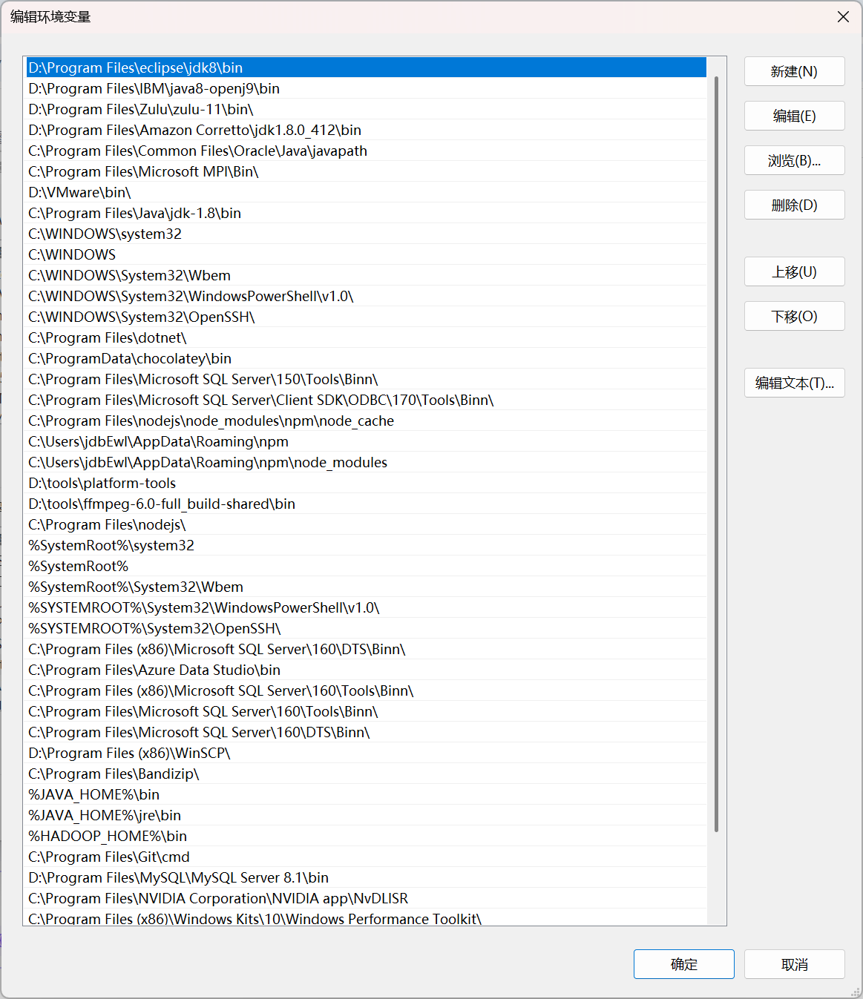

关于Scala的常见使用例

---

# Scala

## Scala运行时在Windows上需要以下前置

::: details
- 一台能安装Windows 7/8/10/11 ~~作业~~操作系统的计算机
- 一个能正常安装IDEA的Windows桌面环境
- 确保你的系统有一个正常的环境变量<br/>
> ~~请确保你的环境变量不要像下面这台电脑被许多软件侵占Path项导致根本不知道能清理什么而污染环境变量~~ 

<p align="center">
  
</p>

当然你的**Hadoop、Spark、Scala**的**bin**目录需要写入环境变量
- 一个能看懂Scala解释器的IDEA和一个精神稳定的人
:::

# 1 关于类继承

> 代码示例，Computer下面存在PC、NotePad子类
```scala
package org.Test.Scala

// 父类Computer
class Computer(val cpu: String, val ram: String, val hd: String) {
  def getDetails: String = s"CPU: $cpu, 内存: $ram, 硬盘: $hd"
}

// PC子类
class PC(cpu: String, ram: String, hd: String, val brand: String)
  extends Computer(cpu, ram, hd) {

  override def getDetails: String =
    super.getDetails + s", 品牌：$brand"
}

// NotePad子类
class NotePad(cpu: String, ram: String, hd: String, val color: String)
  extends Computer(cpu, ram, hd) {

  override def getDetails: String =
    super.getDetails + s", 颜色：$color"
}

// 测试对象
object Test extends App {
  // 创建PC实例
  val pc = new PC("Intel i7", "16GB", "1TB SSD", "Dell")

  // 创建NotePad实例
  val pad = new NotePad("AMD Ryzen", "8GB", "512GB SSD", "黑色")

  // 打印完整配置信息
  println("PC配置：\n" + pc.getDetails)
  println("\n笔记本电脑配置：\n" + pad.getDetails)
}
```

由于Scala语言允许单例继承，因此我们可以创建完Computer类后里面定义一个方法用来返回值<br/>
Scala语言的定义与Java、Python类似，但是并不能直接像Python可以不用定义返回的变量，也不能像Java一样定义返回值在方法名前。

即不允许以下代码实现：

::: warning
def getDetails(int x):<br/>
  return Details<br/>
private String getDetails(){<br/>
  return Details;<br/>
}
:::

而是
```scala
def getDetails: String = s"CPU: $cpu, 内存: $ram, 硬盘: $hd"
```
使用冒号标识getDetails返回的值类型， 并且在这里可以使用“s"\$x,\$y"”，直接格式化返回文本

---
# 2 关于单例继承的链式调用

> 计算圆柱体体积

```scala
package org.Test.Scala

// 圆类Circle
class Circle(private var radius: Double) {
  // 构造方法
  def this() = {
    this(1.0)
  }

  def setRadius(radius: Double): this.type = {
    require(radius > 0,"半径必须为正数")
    this.radius=radius
    this
  }

  def getRadius: Double = radius

  // 计算圆的面积
  def findArea(): Double = {
    math.Pi * math.pow(this.radius,2)
  }
}

// 圆柱类Cylinder
class Cylinder(private var length: Double) extends Circle() {
  // 构造方法
  def this() = {
    this(1.0)
    require(length>0,"高度必须为正数")
  }

  def setLength(length: Double): this.type = {
    require(length > 0,"高度必须为正数")
    this.length = length
    this
  }

  def getLength: Double = length

  //  计算圆柱体积
  def findVolume(): Double = {
    // math.Pi * length * math.pow(super.getRadius,2)
    // 使用继承得到的方法
    super.findArea() * length
  }
}

object TestCylinder extends App {
  // 使用无参构造方法并通过链式调用设置参数
  private val cylinder = new Cylinder().setRadius(3.0).setLength(7.5)

  // 计算结果
  println(f"圆柱体积:${cylinder.findVolume()}%.2f")
}
```

在这里面，由于我们只能单例继承，所以没有办法在TestCylinder中进行对两个类的继承来实现其他语言中的简单实例化创建对象来获得值。<br/>
但是我们可以通过链式调用使用一个类继承一个另一个类，再实例化当前类，使用**super**关键字来取得链式调用中父类中的信息。<br/>
如上述代码实现,可以创建一个无参的构造方法来简化参数传递过程
```scala
class Circle(private var radius: Double){···}// 圆类

class Cylinder(private var length: Double) extends Circle() {···}// 圆柱类

object TestCylinder extends App{ // 继承App类用于测试
  private val cylinder = new Cylinder()
}

  def this(){
    this()
  }// 构造方法填入单例继承类
```
这样通过单例继承的方法就可以在类之间传递方法和参数来实现继承，并且由于**Scala**语言的特殊性，我们可以做出像是“**Cylinder().setRadius(3.0).setLength(7.5)**”的调用方法填入目标对象

::: tip
你知道吗，你不需要单独创建一个带有所有参数的构造方法用来在“**对象名(参数1,参数2,参数3···)**”的实例化对象中，它会自动创建一个带有所有参数的构造方法。
:::
---
# 3 多态的实现

> 员工经理工资计算

```scala
package org.Test.Scala

// 定义员工基类
class Employee(val name: String,val monthSalary: Double) {
  def getAnnual: Double = {
    monthSalary * 12
  }
}

// 工人类继承员工基类
class Worker(name: String, monthlySalary: Double) extends Employee(name, monthlySalary){
  def work(): Unit = {
    println(f"${name}是普通员工")
  }
  override def getAnnual: Double = super.getAnnual
}

// 经理类继承员工基类
class Manager(name: String, monthlySalary: Double, val bonus: Double) extends Employee(name, monthlySalary){

  def manage(): Unit = {
    println(f"${name}是经理")
  }
  override def getAnnual: Double = super.getAnnual + bonus
}

object TestWork {
  // 多态方法展示
  private def showEmpAnnual(emp: Employee): Double = emp.getAnnual

  private def testWork(emp:Employee): Unit = emp match{
    case w: Worker => w.work()
    case m: Manager => m.manage()
  }
  // 程序主入口调用多态方法
  def main(args: Array[String]): Unit = {
    val worker = new Worker("张三", 5000)
    val manager = new Manager("李四", 8000, 20000)

    println(s"${worker.name}年收入：${showEmpAnnual(worker)}")
    println(s"${manager.name}经理年收入：${showEmpAnnual(manager)}")

    testWork(worker)
    testWork(manager)
  }
}
```

在这里我们不使用空构造函数传参，因为会存在一些代码逻辑上的异常，但是~~可能~~能运行。<br/>
定义了一个基类并用两个类继承该基类，由于monthSalary的月工资是固定的，所以我们可以用monthSalary*12得到年工资收入。<br/>
同时在各自内部定义一个函数用来返回值来确认自身身份，并重构方法。<br/>
在TestWork对象类中，创建showEmpAnnual()方法来确认员工年收入，创建testWork方法来使用match匹配对象。<br/>
在main函数中，使用showEmpAnnual()方法来进行对象推断，匹配到目标对象直接调用对象中方法getAnnual()取得值。<br/>
testWork()方法使用match进行指定匹配，若对象为目标对象，则case中存入获得的对象，调用后续方法。<br/>
通过这样的操作实现了程序的多态调用，这代码实现与其他语言存在较大区别，与Java的逻辑还是类似的。