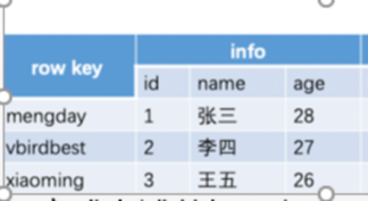

# 测试样本

## HiveQL表

## 这是阿露

## 芝士正态分布
正态分布的一般形式
$$
f(x) = \frac{1}{\sigma \sqrt{2\pi}} \, e^{ -\frac{(x - \mu)^2}{2\sigma^2} }
$$

标准正态分布（μ=0, σ=1）
$$
\phi(x) = \frac{1}{\sqrt{2\pi}} \, e^{ -\frac{x^2}{2} }
$$

参数化显示（显式标注参数）
$$\begin{equation*}
f(x; \mu, \sigma^2) = \frac{1}{\sigma \sqrt{2\pi}} \, \exp\left( -\frac{(x - \mu)^2}{2\sigma^2} \right)
\end{equation*}$$

## 51121512

::: tip
这里需要一个提示
:::

::: warning
叫吧

明知你从未试过挣扎

只在私占叙事里深挖

展示伤疤

简直同你一样廉价

所有你不愿回想的夜晚复现

趁你习得无助的瞬间

它缠绵于是哭着喊着盼着有一天

遇见仅包容属于你的房间

以为路过便跨越时间

可时间会告诉你不会是这一幕的主演

——《你的眼泪同你一样廉价》,停電前夜

<iframe frameborder="no" border="0" marginwidth="0" marginheight="0" width=420 height=100 src="//music.163.com/outchain/player?type=2&id=2671839026&auto=0&height=66"></iframe>
:::

测试视频 
《初星学園, Kijibato, 花海咲季 - EGO》 
PCM封装的MKV源视频，[EGO.mkv](https://raw.kkgithub.com/JDBeWL/docs-vite/main/public/EGO.mkv)
::: danger
<video controls width="540" height="540">
  <source src="/public/EGO.mp4" type="video/mp4">
</video>
:::

::: details
Never gonna give you up
<a href="https://www.bilibili.com/video/BV1GJ411x7h7" >展开</a>
:::

## 你需要在GregTech中做的三件事

- [x] 上线
- [x] 在机器上跳来跳去
- [x] 在机器上跳来跳去
- [x] 在机器上跳来跳去
- [x] 下线

